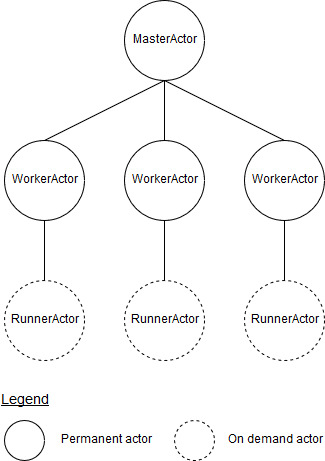
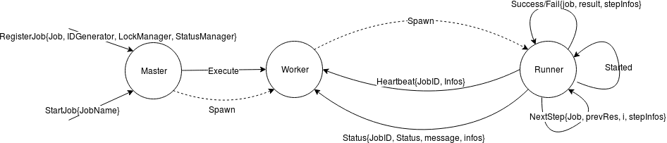

# go-jobs

Library written in Go for running jobs in distributed environment.

## Usage

### Job definition

Split the business logic of the job in steps.

Note: Steps should be not too long to execute as a heartbeat signal is sent only at the end of the execution of it.

```golang
func step1(){
    // Do some stuff
}

func step2(){
    // Do some other stuff
}

var job = NewJob("job1", Steps(step1, step2))
```

NewJob takes can take some options as parameter:

* cleanupStep
* normalTimeout
* executionTimeout
* suicideTimeout

CleanupStep is applied only if one of the steps returns an error. This cleanup step may not be executed if there is an unepxected failure.

If NormalTimeout is exceeded, a log entry is added. Once ExecutionTimeout is exceeded, the job is stopped. SuicideTimeout excess kills the whole application to avoid infinte loop.

### Create a Controller

```golang
var controller, err = NewController("componentName", idGenerator, lockManager) (*Controller, error) {
)
if err != nil {
    // handle error
}
```

`componentName` is the name of the controller instance.
`idGenerator` is a generator of unique ID. In a distributed environment usage of our Flaki project is advised.
`lockManager` is an implementation of a Lock strategy. The library provides a lock implementation for distributed environments.

Use `EnableStatusManager(statusManager)` can be specified to store some informations about the job execution. An implementation is provided by this library in status package.

Use `WithLogger(logger)` to provide a logger.


### Register and schedule the job

```golang
controller.Register(job)
controller.schedule("*/10 * * * *", job.Name())
```

Note: the compatible Cron syntax can be found at https://godoc.org/github.com/victorcoder/dkron/cron

A job must be registered to be able to perform execute/disable/schedule it.

Stop the cron of the controller. All the scheduled tasks will not be executed by this controller instance until Start() is called.

```golang
controller.Start()
```

A specific job can be disabled/enabled, hence according to the Lock policy implementation, a job execution can be disabled for all component instances.

```golang
controller.Disable(job.Name())
```

### Lock

With the distributed lock, we can ensure that a job is executed only once at a time. Let's imagine that there is 3 instances of "keycloak-bridge" and that we want to exectute a backup of the keycloak configuration. We want that only one instance of the bridge executes the backup job.

Lock API:
Each lock has two states that can be represented by the booleans lock and enable. The former is the lock status (locked or unlocked) and the latter is true if the lock is enable, false otherwise. When a lock is disabled the components won't be able to acquire it even it is unlocked. We need this to disable jobs on demand, for example when we want to do an upgrade we don't want parasitic jobs to be executed concurrently. In that case we can simply disable those jobs.

method | description
------ | -----------
Lock | Each job starts with a reservation phase, where the component try to acquire the lock using this method. Only one will acquire the lock and is going to the job execution phase. The others aborts.
Unlock | Releases the lock
OwningLock() | Return true if we are owning the lock, false otherwise
Enable() | Enable the lock. If the lock is disabled, the Lock method will never acquire the Lock.
Disable() | Disable the lock. Here we disable the possibility to acquire the lock, not to confund with unlock.
IsEnabled() | Return true if the lock is enabled, false otherwise.

```go
func New(db DB) *Lock

func (l *Lock) Lock(componentName, componentID, jobName, jobID string, jobMaxDuration time.Duration) error {
    ...
}

func (l *Lock) Lock(componentName, componentID, jobName, jobID string) error {
    ...
}

type Lock interface {
    Enable(componentName string, jobName string) error
    Disable(componentName string, jobName string) error
    IsEnabled(componentName string, jobName string) bool
    Unlock(componentName string, componentID string, jobName string, jobID string) error
    Lock(componentName string, componentID string, jobName string, jobID string, jobMaxDuration time.Duration) error
    OwningLock(componentName string, componentID string, jobName string, jobID string) bool
}
```

name | type | description
--- | ----------- | -------------
component_name | STRING | name of the component (e.g. 'keycloak_bridge')
component_id | STRING | component ID, obtained from flaki at startup. This ID can differentiate two instances of the same component.
job_name | STRING | name of the job
job_id | STRING | job ID, obtained from flaki when the job starts. The ID is associated with one job instance, so if a component exectute a job several times, e.g. a daily backup, each execution will have its own ID.
enabled | BOOL | use to disable jobs, for example during an upgrade we may want to disable some jobs.
status | STRING | status of the job ('RUNNING', 'IDLE')
lock_time | TIMESTAMP | when the lock was acquired

### Status

method | description
------ | -----------
Start | Updates the job's start time in the DB.
GetStartTime() | Get the job's start time
GetStatus() | Return the whole DB entry for the current job.
Update | Updates the job status, with infos about the steps.
Complete | Updates the last_completed_* columns in the DB. It happens when a job is successfull
Fail | Updates the last_failed_* columns in the DB. It happens when a job failed

```go
func New(db DB, componentName, componentID, jobName, jobID string) *Status {
    ...
}

type Status interface {
    Start(componentName, jobName string) error
    Update(componentName, jobName string, stepInfos map[string]string) error
    Complete(componentName, componentID, jobName, jobID string, stepInfos, message map[string]string) error
    Fail(componentName, componentID, jobName, jobID string, stepInfos, message map[string]string) error
    GetStatus(componentName, jobName string) (*Table, error)
    GetStartTime(componentName, jobName string) (time.Time, error)
}
```

The Start method update the start_time in the DB, 
GetStatus
name | type | description
---- | ----------- | -------------
component_name | STRING | name of the component (e.g. 'keycloak_bridge')
component_id | STRING | component ID, obtained from flaki at startup. This ID can differentiate two instances of the same component.
job_name | STRING | name of the job
job_id | STRING | job ID, obtained from flaki when the job starts. The ID is associated with one job instance, so if a component exectute a job several times, e.g. a daily backup, each execution will have its own ID.
start_time | TIMESTAMP | when the job started
last_update | TIMESTAMP | when the step_infos field was last updated. If this field was not updated for a long time, we can guess that the job crashed.
step_infos | STRING | information on the current execution, updated regularly.
message | STRING | message is updated with information about the job execution when the job finishes.
| |
last_completed_component_id | STRING | id of the component that last successfully completed the job
last_completed_job_id | STRING | id of the last successfully completed job
last_completed_start_time | TIMESTAMP | when the last successfully completed job started
last_completed_end_time | TIMESTAMP | when the last successfully completed job ended
last_completed_step_infos | STRING | steps informations for the last successfull job
last_completed_message | STRING | information about the last successfull job
| |
last_failed_component_id | STRING |  id of the component that last unsuccessfully completed the job
last_failed_job_id | STRING | id of the last unsuccessfully completed job
last_failed_start_time | TIMESTAMP | when the last unsuccessfully completed job started
last_failed_end_time | TIMESTAMP | when the last unsuccessfully completed job ended
last_failed_step_infos | STRING | steps informations for the last unsuccessfull job
last_failed_message | STRING | information about the last unsuccessfull job

## Implementation details

This library uses model actor via the protoactor-go (links to the github project) implementation.

The library leverage the actor model using protoactor-go.
The following actors are defined for each Controller instance:
* MasterActor
    * One instance spwan during Controller's creation
    * Handles unexpected failures of WorkerActor
* WorkerActor
    * One instance for each registered job
    * Handles unexpected failures of RunnerActor
    * Check the lock status
    * Persist job statistics and outputs
* RunnerActor
    * Spawn on demand by WorkerActor
    * Execute the job and inform its parent (the worker) about current and final status.



### Unexpected Failure & Timeout Handling

If the RunnerActor fails, WorkerActor restart a new instance of the RunnerActor and launch the execution again.
After the execution of each steps of the Job, a Heartbeat message is sent to the Worker. If no Heartbeat message is received for a duration exceeding the ExecutionTimeout, the Worker orders to the Runner to stop. If the runner is still not stopped after the SuicideTimeout, the runner is very likely in an infinite loop, then the Worker panics.
If the WorkerActor fails, MasterActor is in charge of error handling. It will try to restart the worker unless the cause of the error is a panic due to SuicideTimeout. In this specific case, the MasterActor panic too in order to crash the whole application.

### actor state machine


