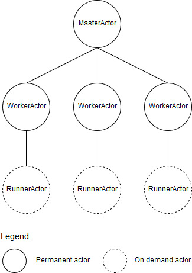
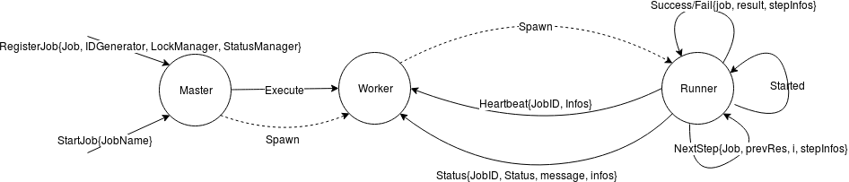

# go-jobs [![Build Status][ci-img]][ci] [![Coverage Status][cov-img]][cov] [![GoDoc][godoc-img]][godoc] [![Go Report Card][report-img]][report]

Library written in Go for running jobs in distributed environment.

## Usage

### Job definition

Split the business logic of the job in steps.

Note: Steps should be not too long to execute as a status signal is sent only at the end of the execution of it.

```golang
func step1(){
    // Do some stuff
}

func step2(){
    // Do some other stuff
}

var job = NewJob("job1", Steps(step1, step2))
```

NewJob takes can take some options as parameter:

* cleanupStep
* normalTimeout
* executionTimeout
* suicideTimeout

CleanupStep is applied only if one of the steps returns an error. This cleanup step may not be executed if there is an unepxected failure.

If NormalTimeout is exceeded, a log entry is added. Once ExecutionTimeout is exceeded, the job is stopped. SuicideTimeout excess kills the whole application to avoid infinte loop.

### Create a Controller

```golang
var (
    // name of the controller instance
    componentName string = ...
    // unique identifier of the controller instance
    componentID string = ...
    // Unique IDs generator. In a distributed environment usage of our Flaki project is advised.
    idGenerator IDGenerator = ...
    // Lock strategy. The library provides a lock implementation for distributed environments.
    lockManager LockManager = ...
)
var controller, err = NewController(componentName, componentID, idGenerator, lockManager)
if err != nil {
    // handle error
}
```

Use `EnableStatusManager(statusManager)` can be specified to store some informations about the job execution. An implementation is provided by this library in status package.

Use `WithLogger(logger)` to provide a logger.

### Register and schedule the job

```golang
controller.Register(job)
controller.schedule("*/10 * * * *", job.Name())
```

Note: the compatible Cron syntax can be found [here](https://godoc.org/github.com/victorcoder/dkron/cron).

A job must be registered to be able to perform execute/disable/schedule it.

Stop the cron of the controller. All the scheduled tasks will not be executed by this controller instance until Start() is called.

```golang
controller.Start()
```

A specific job can be disabled/enabled, hence according to the Lock policy implementation, a job execution can be disabled for all component instances.

```golang
controller.Disable(job.Name())
```

### Lock

With the distributed lock, we can ensure that a job is executed only once at a time. Let's imagine that there is 3 instances of "keycloak-bridge" and that we want to execute a backup of the keycloak configuration. We want that only one instance of the bridge executes the backup job.

Lock API:
Each lock has two states that can be represented by the booleans lock and enable. The former is the lock status (locked or unlocked) and the latter is true if the lock is enable, false otherwise. When a lock is disabled the components won't be able to acquire it even when it is unlocked. We need this to disable jobs on demand, for example when we want to do an upgrade we don't want parasitic jobs to be executed concurrently. In that case we can simply disable those jobs.

method | description
------ | -----------
Lock | Each job starts with a reservation phase, where the component try to acquire the lock using this method. Only one will acquire the lock and is going to the job execution phase. The others aborts.
Unlock | Releases the lock
Enable() | Enable the lock. If the lock is disabled, the Lock method will never acquire the Lock.
Disable() | Disable the lock. Here we disable the possibility to acquire the lock, not to confund with unlock.

```go
type Lock interface {
    Lock(componentName, componentID, jobName, jobID string, jobMaxDuration time.Duration) error
    Unlock(componentName, componentID, jobName, jobID string) error
    Enable(componentName, jobName string) error
    Disable(componentName, jobName string) error
}
```

name | description
--- | ---
componentName | name of the component (e.g. 'keycloak_bridge').
componentID | component ID, obtained at startup. This ID can differentiate two instances of the same component.
jobName | name of the job.
jobID | job ID, obtained when the job starts. The ID is associated with one job instance, so if a component exectute a job several times, e.g. a daily backup, each execution will have its own ID.
jobMaxDuration | max duration of the job. It is use to detect blocked jobs.

### Status

The status of the different jobs are stored in DB. For each job, several pieces of information are tracked:

* component that executes the job
* start time
* last updated
* information about the job steps
* information about the last successful job
  * component that did it
  * start/finish time
  * steps information
  * completion message
* information about the last unsuccessful job
  * component that did it
  * start/finish time
  * steps information
  * completion message

method | description
------ | -----------
Register | Register the job, i.e. create an entry in the status table.
Start | Updates the job's start time in the DB.
Update | Updates the job status, with infos about the steps.
Complete | Complete is called when the job finish successfully. It updates info about the job completion.
Fail | Fail is called when the job fails. It updates info about the failure cause.
GetStatus | Return the whole DB entry for the current job.
GetStartTime | Get the job's start time

```go
type Status interface {
    Register(componentName, componentID, jobName, jobID string)
    Start(componentName, componentID, jobName string) error
    Update(componentName, componentID, jobName string, stepInfos map[string]string) error
    Complete(componentName, componentID, jobName, jobID string, stepInfos, message map[string]string) error
    Fail(componentName, componentID, jobName, jobID string, stepInfos, message map[string]string) error
    GetStatus(componentName, componentID, jobName string) (*Table, error)
    GetStartTime(componentName, componentID, jobName string) (time.Time, error)
}
```

name | description
--- | ---
componentName | name of the component (e.g. 'keycloak_bridge').
componentID | component ID, obtained at startup. This ID can differentiate two instances of the same component.
jobName | name of the job.
jobID | job ID, obtained when the job starts. The ID is associated with one job instance, so if a component exectute a job several times, e.g. a daily backup, each execution will have its own ID.
stepInfos | contains information about the steps execution.
message | contains information about the job completion.

## Implementation details

This library uses model actor via the [protoactor-go](https://github.com/AsynkronIT/protoactor-go) implementation.

The library leverage the actor model using protoactor-go.
The following actors are defined for each Controller instance:

* MasterActor
  * One instance spwan during Controller's creation
  * Handles unexpected failures of WorkerActor
* WorkerActor
  * One instance for each registered job
  * Handles unexpected failures of RunnerActor
  * Check the lock status
  * Persist job statistics and outputs
* RunnerActor
  * Spawn on demand by WorkerActor
  * Execute the job and inform its parent (the worker) about current and final status.



### Unexpected Failure & Timeout Handling

If the RunnerActor fails, WorkerActor restart a new instance of the RunnerActor and launch the execution again.
After the execution of each steps of the Job, a status message is sent to the Worker. If no status message is received for a duration exceeding the ExecutionTimeout, the Worker orders to the Runner to stop. If the runner is still not stopped after the SuicideTimeout, the runner is very likely in an infinite loop, then the Worker panics.
If the WorkerActor fails, MasterActor is in charge of error handling. It will try to restart the worker unless the cause of the error is a panic due to SuicideTimeout. In this specific case, the MasterActor panic too in order to crash the whole application.

### actor state machine



## Tests

The unit tests don't cover:

* lock (go-jobs/lock)
* status (go-jobs/status)

Both are covered by integration tests. To run them, you need:

* an initialised [cockroach](https://www.cockroachlabs.com/docs/stable/install-cockroachdb.html) node
* create a user with name \<user>
* create a database \<db>
* grant all on  \<db> to \<user>

Then run the tests with the following commands:

```bash
# Lock
go test -v -coverprofile=/tmp/go-code-cover github.com/cloudtrust/go-jobs/lock -tags=integration --hostport=<host:port> --user=<user> --db=<db>

# Status
go test -v -coverprofile=/tmp/go-code-cover github.com/cloudtrust/go-jobs/status -tags=integration --hostport=<host:port> --user=<user> --db=<db>
```

[ci-img]: https://travis-ci.org/cloudtrust/go-jobs.svg?branch=master
[ci]: https://travis-ci.org/cloudtrust/go-jobs
[cov-img]: https://coveralls.io/repos/github/cloudtrust/go-jobs/badge.svg?branch=master
[cov]: https://coveralls.io/github/cloudtrust/go-jobs?branch=master
[godoc-img]: https://godoc.org/github.com/cloudtrust/go-jobs?status.svg
[godoc]: https://godoc.org/github.com/cloudtrust/go-jobs
[report-img]: https://goreportcard.com/badge/github.com/cloudtrust/go-jobs
[report]: https://goreportcard.com/report/github.com/cloudtrust/go-jobs
