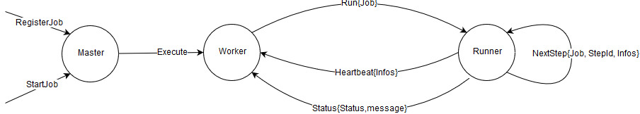

# go-jobs

Jobs library for Go

Library for running jobs on distributed environments.
A database is used to store informations about jobs and ensure only one instance of a job run at once.

## Usage

Create a new Scheduler.

```golang
var scheduler, err = NewScheduler(DBConnection)
if err != nil {
    // handle error
}
```

You can configure the SuicideTimeout by submitting option to the call to New.
The default suicide timeout is set to 0, meaning no timeout.
SuicideTimeout is used to determine after which delay without answer of a Runner should the library crash the whole application.

Split the business logic of the job in steps.

Note: Steps should be not to long to execute as heartbeat signal is sent only at the end of execution of it. A too long step may triggers a timeout of the Job.

```golang
func step1(){
    // Do some stuff
}

func step2(){
    // Do some other stuff
}
```

Create a new Job

```golang
var job = NewJob("job1", Steps(step1, step2))
```

You can configure jobs with cleanupStep, normalTimeout, executionTimeout. NewJob takes a variable number of option as parameter. If no option is given, the following default parameters are applied:
* cleanupStep: nil
* normalTimeout: 0
* executionTimeout: 0

CleanupStep is applied if one of step returns with an error. This cleanup step may be not executed if there is unepxected failure.


Register and schedule the job

```golang
scheduler.Register("job1", job)
scheduler.schedule("*/10 * * * *", "job1")
scheduler.schedule("0 0 * * 0", "job1")
```

Note: Cron syntax can be found at "link to kron"

Register a job with a identifier and uses this identifier to lanch the job according to some cron expression.
The lock exclusion is based on the identifier. If the same Job is register twice with different label, if is possible to run it concurrently.

Start the scheduler

```golang
scheduler.Start()
```

A specific job can be disabled/enabled, hence the job will finish if it is currently running but next executions triggers will be skipped.

```golang
scheduler.disable("job1")
```

Job executions can be paused locally, and other scheduler instances running can still execute the job.

```golang
scheduler.Stop()
```


## Implementation details

This library uses model actor via the protoactor-go (links to the github project) implementation.

The library leverage the actor model using protoactor-go. 
The following actors are defined:
* MasterActor
    * One instance spwan while Scheduler's creation
    * Handles unexpected failures of WorkerActor
* WorkerActor
    * One instance for each registered job
    * Handles unexpected failures of RunnerActor
    * Check the lock status
    * Persist job statistics and outputs
* RunnerActor
    * Spawn on demand by WorkerActor
    * Execute the job and inform its parent (the worker) about current and final status.


### Unexpected Failure & TImeout Handling

If the RunnerActor fails, WorkerActor restart a new instance of the RunnerActor. (TODO check if the current execution fo the Job should be set again, very likely needed)
After the execution of each steps of the Job, a Heartbeat message is sent to the Worker. If no Heartbeat message is received for a duration exceeding the ExecutionTimeout, the Worker orders to the Runner to stop. If the runner is still not stopped after the SuicideTimeout, the runner is very likely in an infinite loop, then the Worker panic.
If the WorkerActor fails, MAsterActor is in charge of error handling. It will try to restart the worker unless the cause of the error is a panic due to SuicideTimeout. In this specific case, the MasterActor panic too in order to crash the whole application.


### Messages

* RegisterJob (id, job)
Message sent to Master by API to Register a job with label id
* StartJob (id)
Message sent to Master by API to launch execution of job registered with id
* Execute
Message sent by Master to Worker in response of StartJob message
* Run
Worker spawn new Runner actor and sent Run to it.
* NextStep
Runner sent to itself NextStep for each Steps composing the job
* Heartbeat
Runner send it to Worker after execution of each step to inform it is still alive and provide informations about current status
* Status
Runner send it to Worker once the job is fully executed.



### States

* MasterActor
list of workers, one for each registered job
* WorkerActor
job assigned to this worker
currentTimeout stage
* RunnerActor
No state

## Cockroach DB reservation api

With the reservation API, we can ensure that a job is executed only once at a time. Let's imagine that there is 3 instances of "keycloak-bridge" and that we want to exectute a backup of the keycloak configuration. We want that only one instance of the bridge executes the backup job.

Lock API:
Each lock has two states that can be represented by the booleans lock and enable. The former is the lock status (locked or unlocked) and the latter is true if the lock is enable, false otherwise. When a lock is disabled the components won't be able to acquire it even it is unlocked. We need this to disable jobs on demand, for example when we want to do an upgrade we don't want parasitic jobs to be executed concurrently. In that case we can simply disable those jobs.

method | description
------ | -----------
Lock | Each job starts with a reservation phase, where the component try to acquire the lock using this method. Only one will acquire the lock and is going to the job execution phase. The others aborts.
Unlock | Releases the lock
OwningLock() | Return true if we are owning the lock, false otherwise
Enable() | Enable the lock. If the lock is disabled, the Lock method will never acquire the Lock.
Disable() | Disable the lock. Here we disable the possibility to acquire the lock, not to confund with unlock.
IsEnabled() | Return true if the lock is enabled, false otherwise.

```go
func New(db DB, componentName, componentID, jobName, jobID string, jobMaxDuration time.Duration) *Lock {
    ...
}

type Lock interface {
    Lock() error
    Unlock() error
    OwningLock() bool
    Enable() error
    Disable() error
    IsEnabled() bool
}
```

name | type | description
--- | ----------- | -------------
component_name | STRING | name of the component (e.g. 'keycloak_bridge')
component_id | STRING | component ID, obtained from flaki at startup. This ID can differentiate two instances of the same component.
job_name | STRING | name of the job
job_id | STRING | job ID, obtained from flaki when the job starts. The ID is associated with one job instance, so if a component exectute a job several times, e.g. a daily backup, each execution will have its own ID.
enabled | BOOL | use to disable jobs, for example during an upgrade we may want to disable some jobs.
status | STRING | status of the job ('RUNNING', 'IDLE')
lock_time | TIMESTAMP | when the lock was acquired

### Status

method | description
------ | -----------
Start | Updates the job's start time in the DB.
GetStartTime() | Get the job's start time
GetStatus() | Return the whole DB entry for the current job.
Update | Updates the job status, with infos about the steps.
Complete | Updates the last_completed_* columns in the DB. It happens when a job is successfull
Fail | Updates the last_failed_* columns in the DB. It happens when a job failed

```go
func New(db DB, componentName, componentID, jobName, jobID string) *Status {
    ...
}

type Status interface {
    Start() error
    GetStatus() (*Table, error)
    GetStartTime() (time.Time, error)
    Update(stepInfos map[string]string) error
    Complete(stepInfos, message map[string]string) error
    Fail(stepInfos, message map[string]string) error
}
```

The Start method update the start_time in the DB, 
GetStatus
name | type | description
---- | ----------- | -------------
component_name | STRING | name of the component (e.g. 'keycloak_bridge')
component_id | STRING | component ID, obtained from flaki at startup. This ID can differentiate two instances of the same component.
job_name | STRING | name of the job
job_id | STRING | job ID, obtained from flaki when the job starts. The ID is associated with one job instance, so if a component exectute a job several times, e.g. a daily backup, each execution will have its own ID.
start_time | TIMESTAMP | when the job started
last_update | TIMESTAMP | when the step_infos field was last updated. If this field was not updated for a long time, we can guess that the job crashed.
step_infos | STRING | information on the current execution, updated regularly.
message | STRING | message is updated with information about the job execution when the job finishes.
| |
last_completed_component_id | STRING | id of the component that last successfully completed the job
last_completed_job_id | STRING | id of the last successfully completed job
last_completed_start_time | TIMESTAMP | when the last successfully completed job started
last_completed_end_time | TIMESTAMP | when the last successfully completed job ended
last_completed_step_infos | STRING | steps informations for the last successfull job
last_completed_message | STRING | information about the last successfull job
| |
last_failed_component_id | STRING |  id of the component that last unsuccessfully completed the job
last_failed_job_id | STRING | id of the last unsuccessfully completed job
last_failed_start_time | TIMESTAMP | when the last unsuccessfully completed job started
last_failed_end_time | TIMESTAMP | when the last unsuccessfully completed job ended
last_failed_step_infos | STRING | steps informations for the last unsuccessfull job
last_failed_message | STRING | information about the last unsuccessfull job
